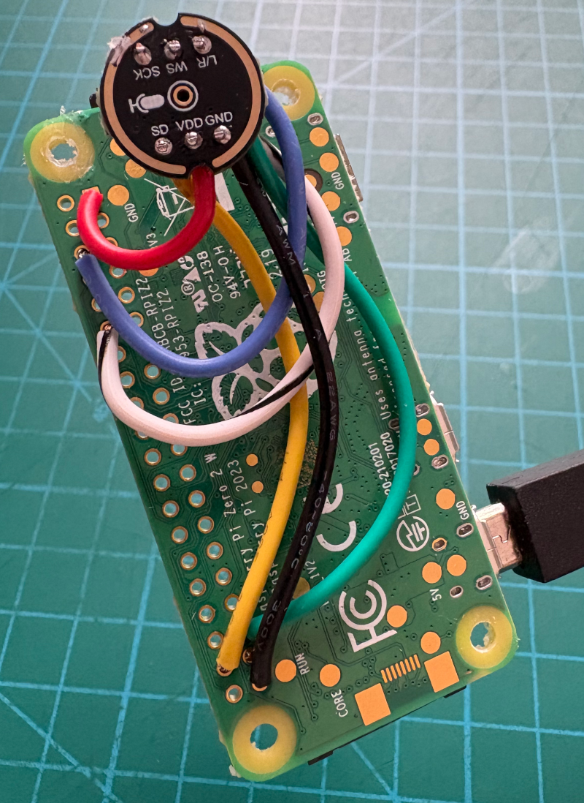

# laundry-sensor

A Raspberry Pi Zero 2W with a microphone that listens to the laundry
room. It records audio for downstream AI analysis of washer and dryer
sound signatures to detect when a cycle is complete. A web UI lets you
start/stop recordings and play them back from any device on the network.



## Hardware

| Component   | Details |
|-------------|---------|
| SBC         | Raspberry Pi Zero 2W (Debian Trixie Lite, aarch64) |
| Microphone  | INMP441 I2S MEMS omnidirectional mic (soldered to GPIO) |
| Power       | 5V USB wall charger via micro-USB |
| Enclosure   | 3D-printed two-piece case (`laun_frt.3mf`, `laun_bk.3mf`) |
| Network     | Hostname `laundry` (mDNS `laundry.local`) |

See [CAPTURE_SETUP.md](CAPTURE_SETUP.md) for wiring diagrams, boot
configuration, and capture planning.

## Deploy

A single command deploys the server to the Pi over SSH:

```bash
python deploy.py
```

This SCPs the app files to the Pi and runs a setup script that:

1. Copies `laundry_server.py` and `requirements.txt` to `/opt/laundry-sensor/`
2. Creates a Python venv and installs FastAPI + uvicorn
3. Creates `/home/willipe/recordings/` for audio files
4. Generates a self-signed TLS certificate in `/etc/laundry-sensor/` (first deploy only)
5. Installs and starts the `laundry-sensor` systemd service

Subsequent deploys after code changes are the same single command.

### Service management

```bash
sudo systemctl status laundry-sensor
sudo systemctl restart laundry-sensor
sudo journalctl -u laundry-sensor -f
```

### Storage

Recordings are 48 kHz mono WAV files (~0.7 GB/hour). A full washer +
dryer cycle (~2 hours) uses roughly 1.4 GB. Use a large SD card or
pull files off periodically.

## HTTPS with mkcert

The initial deploy creates a self-signed certificate, which works but
causes browsers to show a "Your connection is not private" warning on
every visit. [mkcert](https://github.com/FiloSottile/mkcert) solves
this by creating a local Certificate Authority that your machine trusts.

### Setup (one-time, on your Mac)

```bash
brew install mkcert
mkcert -install
mkcert laundry
```

`mkcert -install` creates a local CA and adds it to your macOS keychain.
`mkcert laundry` generates `laundry.pem` and `laundry-key.pem` signed
by that CA.

### Install the certs on the Pi

```bash
scp laundry.pem laundry-key.pem willipe@laundry:/tmp/
ssh willipe@laundry 'sudo cp /tmp/laundry.pem /etc/laundry-sensor/cert.pem && sudo cp /tmp/laundry-key.pem /etc/laundry-sensor/key.pem && sudo systemctl restart laundry-sensor'
```

After this, `https://laundry` loads without any certificate warnings in
Chrome, Safari, or Firefox on the Mac where you ran `mkcert -install`.

### How it works

The server binds to port 443 with TLS and reads its cert and key from
`/etc/laundry-sensor/`. The mkcert-generated files are drop-in
replacements for the self-signed ones created during the first deploy.
The root CA private key stays on your Mac (in
`~/Library/Application Support/mkcert/`), so only you can issue trusted
certs. No changes are needed to the server or deploy script.

### Trusting on other devices

To trust the certs on another Mac, copy the root CA and install it:

```bash
mkcert -install  # on the other Mac, after copying the CA files
```

On iOS, you can AirDrop the root CA (`mkcert -CAROOT` to find it),
install the profile, and enable full trust in Settings > General >
About > Certificate Trust Settings.
