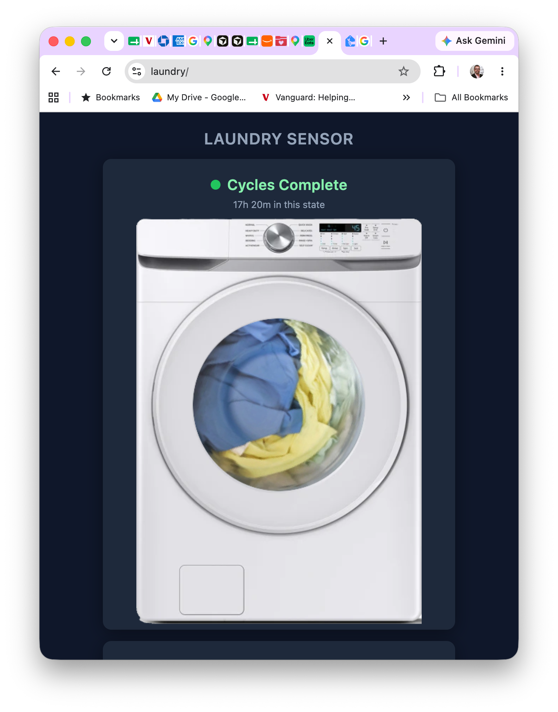

# laundry-sensor

A Raspberry Pi Zero 2W with a USB microphone that listens to the laundry
room and classifies audio to determine whether a cycle is running or
complete. A web UI shows the current state at a glance.



## How it works

Every 60 seconds the server records a 5-second audio sample from the
mic, computes a 32-band log-mel energy fingerprint, and compares it
(weighted L2 distance) against reference signatures stored in
`signatures.json`. There are four internal classification states:

| State | Meaning |
|-------|---------|
| BOTH_STOPPED | Neither machine is running |
| WASHER_ONLY | Washer running, dryer off |
| DRYER_ONLY | Dryer running, washer off |
| BOTH_RUNNING | Both machines running |

The UI collapses these into two user-facing states:

- **Cycles Complete** (green) — `BOTH_STOPPED`
- **Cycles In Progress** (blue, machine animates) — any other state

A debounce of 2 consecutive samples is required before a state
transition is accepted, preventing brief noise from causing false
switches. State changes are logged to `history.log` with timestamps.

## Retraining

If the classifier is wrong (e.g., it thinks the washer is running when
it isn't), press **Retrain** in the web UI, then select the correct
state. The server captures a fresh sample and blends it into the
matching signature using exponential moving average (alpha = 0.1). The
updated `signatures.json` is saved to disk immediately.

Over a few corrections the signatures converge on your specific
machines and room acoustics.

## Calibration

The **calibrate** endpoint records 30 seconds of silence and computes
an offset between what the mic hears and the stored "both stopped"
signature. This compensates for mic hardware differences or ambient
noise floor changes. The calibration is persisted in
`/var/lib/laundry-sensor/calibration.json`.

## Hardware

| Component   | Details |
|-------------|---------|
| SBC         | Raspberry Pi Zero 2W (Debian Trixie Lite, aarch64) |
| Microphone  | USB audio adapter with omnidirectional mic |
| Power       | 5V USB wall charger via micro-USB |
| Network     | Hostname `laundry` (mDNS `laundry.local`) |

## Deploy

A single command deploys the server to the Pi over SSH:

```bash
python deploy.py
```

This SCPs the app files to the Pi and runs a setup script that:

1. Copies server code, signatures, and static assets to `/opt/laundry-sensor/`
2. Creates a Python venv and installs FastAPI + uvicorn + numpy
3. Creates `/home/willipe/recordings/` for audio files
4. Generates a self-signed TLS certificate in `/etc/laundry-sensor/` (first deploy only)
5. Installs and starts the `laundry-sensor` systemd service

Subsequent deploys after code changes are the same single command.

### Service management

```bash
sudo systemctl status laundry-sensor
sudo systemctl restart laundry-sensor
sudo journalctl -u laundry-sensor -f
```

## HTTPS with mkcert

The initial deploy creates a self-signed certificate, which works but
causes browsers to show a security warning. [mkcert](https://github.com/FiloSottile/mkcert)
creates a local Certificate Authority that your machine trusts.

### Setup (one-time, on your Mac)

```bash
brew install mkcert
mkcert -install
mkcert laundry
```

### Install the certs on the Pi

```bash
scp laundry.pem laundry-key.pem willipe@laundry:/tmp/
ssh willipe@laundry 'sudo cp /tmp/laundry.pem /etc/laundry-sensor/cert.pem && sudo cp /tmp/laundry-key.pem /etc/laundry-sensor/key.pem && sudo systemctl restart laundry-sensor'
```

After this, `https://laundry` loads without certificate warnings on
the Mac where you ran `mkcert -install`.

## Recording (training data collection)

The web UI also has a recorder for capturing long audio sessions used
to build initial signatures. Start recording before loading the washer,
use the Notes panel to tag state transitions, then download the
recording + notes as a zip for offline analysis.

## Configuration

All tunables are set via environment variables (defaults shown):

| Variable | Default | Purpose |
|----------|---------|---------|
| `MONITOR_INTERVAL_SEC` | 60 | Seconds between audio samples |
| `SAMPLE_SECONDS` | 5 | Duration of each audio capture |
| `DEBOUNCE_SAMPLES` | 2 | Consecutive matching samples before state change |
| `MAX_DIST_FOR_CONFIDENCE` | 50.0 | Distance threshold above which classification is "UNKNOWN" |
| `RETRAIN_ALPHA` | 0.1 | EMA blend factor for retraining |
| `CAL_OFFSET_DB` | (empty) | Manual dB offset override (bypasses calibration file) |
